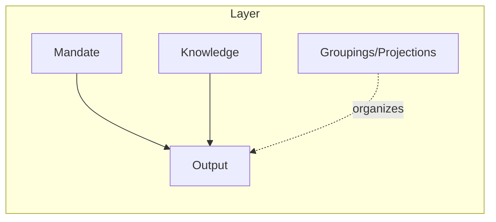
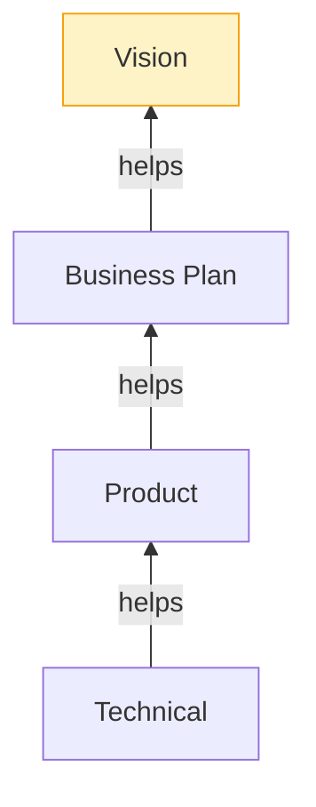
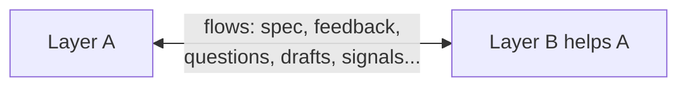
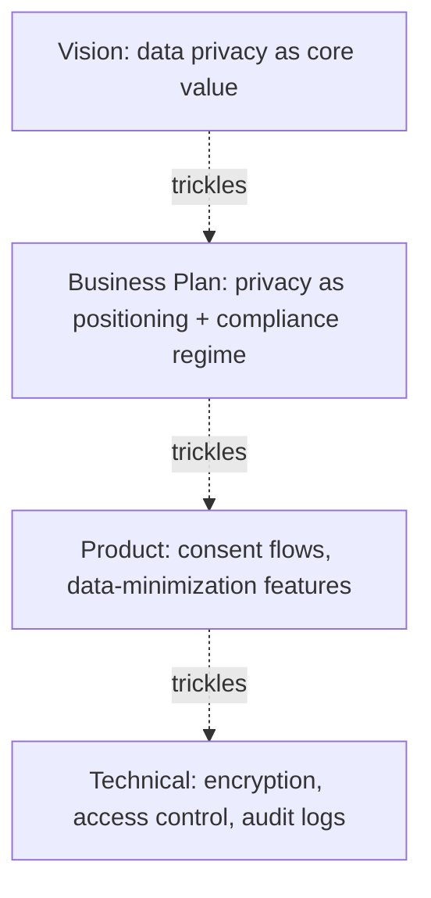
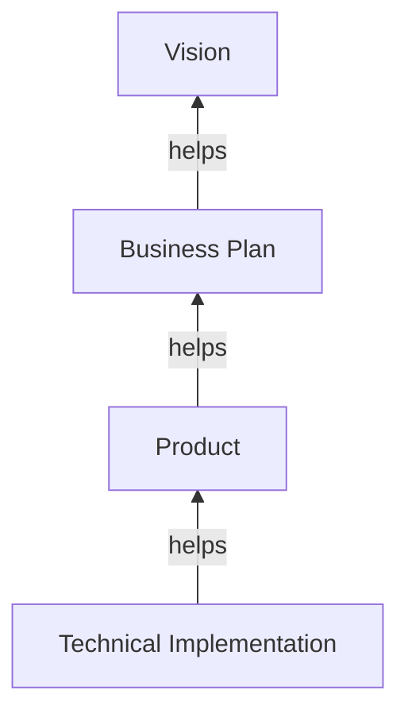
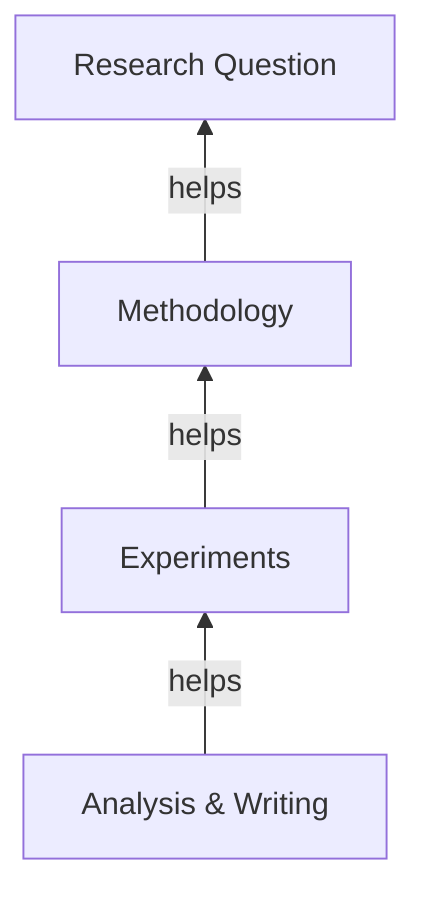
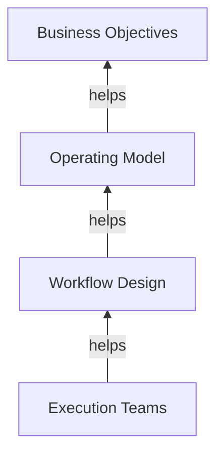

# The Layered Endeavor Framework

*A spec-driven, layered approach to organizing any endeavor — a project, a research program, a company, an operation — where the work is performed by humans, AI agents, or both.*

---

## 1. What this is

The Layered Endeavor Framework is a small set of structural principles for decomposing a complex endeavor into **layers of interfaces**, where each layer has a clean responsibility, a defined relationship to one other layer, and a transitive line of alignment back to the originating intent.

It generalizes ideas from spec-driven development, layered software architecture, hierarchical multi-agent orchestration, and strategic-alignment cascades into a single substrate that doesn't care whether the "agent" at any given layer is a human, an AI, or a team of both.

The framework is a **philosophy**, not a methodology. It commits to a small number of structural rules (the principles below) and is deliberately silent on everything else (number of layers, direction of flow, cadence, tooling, artifact format). Adopters customize within those rules; the rules themselves are the contract.

---

## 2. Why this framework

Every complex endeavor faces the same underlying problem: **how do we keep many concurrent activities aligned with the originating intent, without forcing every activity to hold the entire context at once?**

In principle, a sufficiently capable single agent — a hypothetical AI with unlimited context and expertise — could hold all of vision, business, product, and implementation in one mind and produce a coherent endeavor. We layer for three reasons:

1. **Context limits.** Humans have working-memory limits; AI agents have context windows. Layering is a concession to those limits, not an intrinsic feature of the problem.
2. **Specialization.** Different parts of the work need different expertise, and clean boundaries let specialists operate within their mandate.
3. **Diagnosability.** When something is wrong, layered structure lets you localize the problem.

This framing has a useful corollary: **as agent capability grows, the optimal number of layers shrinks.** The framework should reduce gracefully toward a single layer when context allows, rather than imposing layers as ceremony.

---

## 3. Anatomy of a layer

A layer is fully specified by five properties:

| Property | What it is |
|---|---|
| **Mandate** | What this layer is responsible for producing. Its single, scoped purpose. |
| **Knowledge** | The expertise, context, and information this layer operates with. Defines what kinds of help it can give. |
| **Output** | The artifact(s) the layer produces — its contribution to the endeavor. |
| **Help target** | The single other layer this layer is responsible for helping (see §4.3). The root layer has none. |
| **Groupings / projections** | Optional internal structure: how the layer organizes its content, and what scoped views it exposes (see §7). |

A layer is well-formed when its mandate, knowledge, and output are mutually consistent — the knowledge supports the mandate, the output fulfills the mandate, and nothing in the output exceeds the mandate.

---

## 4. The principles

### 4.1 Architecture — endeavors are layered interfaces

An endeavor is decomposed into a set of layers, each producing a specified output. Common layer choices for a software-product endeavor: vision, business plan, product, technical implementation. Other domains will have different cuts (see §11 for examples). The choice of layers is **art**, constrained but not determined by the framework.

### 4.2 Intralayer — single responsibility, no overlap

Each layer owns its mandate fully and exclusively. No reaching across layers. No redundant ownership of the same concern between two layers. If two layers seem to claim the same responsibility, the layering is wrong and needs to be re-cut.

This is the layered-architecture analogue of the MECE principle (mutually exclusive, collectively exhaustive) and the Single Responsibility Principle.

### 4.3 Interaction — the one-help rule

**Every layer except the root is responsible for helping exactly one other layer.** The root (typically the vision or originating-intent layer) has no help target; instead, every other layer is connected to the root through the help relation, possibly transitively.

This produces a tree rooted at the originating intent.

The one-help rule does two distinct jobs:

- **Alignment property.** If every non-root layer is aligned with the layer it helps, then by transitivity every layer is aligned with the root. Alignment falls out of the structure for free, with no separate audit mechanism required.
- **Design discipline.** The constraint forces clean layering. The question "if this layer can only meaningfully help one other, *which one*?" is exactly the question that produces good layer cuts. Without the constraint, layers tend to accumulate diffuse partial relationships and no layer has a sharp mandate.

### 4.4 Flow — direction is customizable

The framework does not mandate the direction of flow between layers. Common patterns:

- **Primarily one-directional**: information flows mostly in one direction along the tree (e.g., specification from root toward leaves), with return flows of fulfillment and feedback through the same channels.
- **Bidirectional**: connected layers iterate continuously with each other.
- **Eventually-stable**: directionality is a practical scaffold; over time the layers settle into mutual consistency.

The principles (intralayer responsibility, one-help, transitive connection to root) hold regardless of flow direction.

### 4.5 Flows along the help relation

The help relation between two layers is not a single arrow. It is a channel along which several flows can run, and the framework is deliberately neutral about which flows exist in which direction.

The arrows do not encode hierarchy or seniority. The tree is rooted at the originating intent for *alignment grounding*, not because the root is "above" the rest. Calling a layer "upper" or "lower" is a visualization convenience, not a claim about importance or authority.

Two common flow examples, useful for orientation but not canonical:

- **Specification flow** — intent, requirements, and constraints flowing from the helped layer toward its helper. ("Here is what I need from you.")
- **Fulfillment / feedback flow** — work product flowing back, including pushback: infeasibility signals, suggested constraint loosening, opportunities the helped layer didn't know existed. ("Here is what I produced, and here is what I learned that should reshape your spec.")

Naming both matters because the helper carries knowledge the helped layer doesn't have, and that knowledge can productively change the spec. But other flows are equally legitimate: questions, drafts, partial milestones, signals about confidence or readiness, requests for more context. The principle is that the help relation is a *bidirectional channel* whose flow composition is itself a design choice — not a fixed pair of arrows.

### 4.6 Recursive layering

Each layer can itself be decomposed into sublayers under the same principles. The framework is fractal: the rules that govern the top-level layering also govern any internal decomposition. This is how a layer scales up in complexity without violating its mandate.

---

## 5. Cross-cutting concerns

Concerns that seem to apply everywhere — security, privacy, ethics, observability, brand, accessibility, compliance — are notorious for resisting tree-shaped placement. The conventional response is a single org-wide policy document. This usually fails: the document is stated at a level of abstraction that matches no layer's working reality, each layer translates it implicitly anyway, and the appearance of central handling masks the actual local re-interpretation.

The framework's approach: **a cross-cutting concern enters the tree at some layer and propagates as a first-class requirement, customized by each layer for its own vocabulary.**

This works because the framework already provides traceability for free (§6). The customized version at each layer references its parent in the trickle, so all four layers' privacy work descends from a single root statement and drift can be detected by walking the tree.

The clean implication: **cross-cutting concerns don't need a special mechanism.** They are just additional inputs into a layer's mandate, propagated via the same one-help relation that handles everything else. This simplifies the framework rather than expanding it.

---

## 6. Traceability is free

A direct consequence of the tree structure: every output, requirement, decision, or concern has a traceable lineage through first-degree help relationships back to the root. The tree *is* the trace.

Most frameworks bolt traceability on as audit infrastructure. Here it is a structural property — anything you want to trace is already trace-able by construction. If something seems hard to trace, it's because the layering itself is broken.

---

## 7. Internal structure of a layer: groupings, projections, milestones, and context scope

A layer is more than a single undifferentiated blob. Layers typically need internal structure of three flavors — groupings, projections, and milestones — and the choice of how much of that structure to share with a connected layer is itself a fourth design lever, *context scope*.

### 7.1 Groupings as outcome structure

A grouping inside a layer can correspond to a real split in what the layer produces — two product lines, two codebases, two market segments, two research tracks. In this case the grouping is consequential: it commits the layer to multiple distinct outputs, not just multiple ways of organizing one output.

### 7.2 Projections as scoped views

A layer can expose multiple scoped views of itself for different consumers. A product layer might project to:
- the technical layer, organized by implementation cluster;
- the business layer, organized by revenue model;
- a UX sublayer, organized by user journey.

Same underlying layer-state, different lenses. Projections do three pieces of real work:

1. **Context management.** Projections decide what fits into any given conversation or context window — the practical lever for the framework's claim that layers exist to fit context budgets.
2. **Multi-consumer interfaces.** A layer can serve multiple readers without polluting any single interface with everything-everyone-might-want.
3. **Internal refactoring without breaking consumers.** A layer can rearrange its internals as long as projections stay stable — the same property well-designed APIs have.

### 7.3 Milestones as temporal structure

A layer's output is rarely produced in one shot. It evolves through milestones — versions, releases, phases, drafts, increments — and the framework treats this temporal structure as first-class.

Each layer can carry multiple milestones, and **which milestones are shared with a connected layer is a sharing choice**, not a default. A layer might share early drafts with its helper to enable early feedback, share only stable releases to avoid churn, or share different milestones with different connected layers.

This partially closes the question of how layers handle change over time: when a layer's output changes, the change is expressed as a new milestone, and connected layers ingest it according to the sharing policy in place.

### 7.4 Context scope as a design variable

The amount of context a layer shares with a connected layer determines how comprehensive that layer's contribution can be — and it sits on a curve, not a maximize-it dial.

- **Too little context** and the connected layer's solution is shallow because it can't see what would make it comprehensive. Constraints get re-discovered the hard way.
- **Too much context** and you blow context budgets, leak information that should stay scoped (privacy, IP, organizational sensitivity), or invite the connected layer to over-reach beyond its mandate.

Right-sizing context is its own design decision, and it changes over time and per relationship. Projections (§7.2) and selective milestone sharing (§7.3) are the *mechanisms* that make context scope adjustable; this principle is *why* the adjustment matters.

A useful default: share the smallest context that lets the connected layer give a comprehensive contribution within its mandate, and expand only when shallowness shows up as feedback.

### 7.5 Heuristic: don't structure prematurely

The "don't group prematurely" instinct generalizes to all three flavors of internal structure:

- A grouping is justified when it reduces context load for a real consumer, enables a real access or privacy boundary, or corresponds to a real outcome split.
- A projection is justified when a connected layer actually needs a different lens, not when it might one day.
- A milestone is justified when there is a real reason to mark and possibly share an intermediate state — not because intermediate states "should" be tracked.

Structure created reactively in response to a real need tends to survive. Structure created proactively because organization "feels right" tends to constrain without paying for itself. Premature structure freezes the layer before usage patterns reveal themselves and forces connected layers to work around the structure rather than through it.

### 7.6 Internal structure vs. the one-help rule

All four mechanisms — groupings, projections, milestones, context scope — operate **within a layer** and are orthogonal to the one-help rule, which governs **between layers**.

A useful distinction to keep them clean:

- **Help relationships** are responsibility-bearing. They carry mutual obligations, drive influence and modification, and form the tree.
- **Informational projections, shared milestones, and context-scope adjustments** are sharing choices. They don't carry responsibility, and a layer exposing structure to another doesn't make that other layer a help target.

So a technical layer *helps* product (its one parent in the tree), but might *expose* a feasibility-summary projection to vision or business for visibility, or share milestone signals with neighbors for planning. None of those constitute help relationships, and none of them violate the tree.

---

## 8. Robustness properties

The framework's properties are a direct consequence of its principles:

| Property | Source |
|---|---|
| **Transitive alignment** | One-help rule + connection to root → tree → transitivity. |
| **Free traceability** | Tree structure means every artifact has a path to the root. |
| **Hydratable** | A layer can start with a minimal output and be enriched over time; the inter-layer principles drive the enrichment. |
| **Customizable** | The principles are fixed; flow direction, layer count, artifact format, and cadence are open. |
| **Graceful reduction** | When one agent has full capability and context, the framework collapses to one layer without violating its rules. |
| **Diagnosable** | Misalignment surfaces at the boundary between two adjacent layers, not in a global pile. |
| **Exploration-safe** | A layer can experiment freely within its mandate; misalignment surfaces at the help boundary and either propagates as improvement or reverts. |
| **Async-friendly** | The principles together — single help relationship per layer, intralayer responsibility, milestones as explicit checkpoints, projections as stable interfaces, context scope as a sharing choice — mean layers can operate concurrently without continuous synchronization. The framework doesn't require async (synchronous teams use it fine), but it makes async genuinely safe, which most coordination frameworks don't. |

---

## 9. What the framework does not commit to

Deliberately left open:

- **How many layers.** Domain- and capability-dependent.
- **Which layers.** The art of layering.
- **Direction of flow.** Primarily one-directional, bidirectional, eventually-stable — all valid.
- **Artifact format.** Markdown specs, code, diagrams, conversations, OKRs — all valid.
- **Cadence and process.** Continuous, milestone-driven, async, sync — all valid.
- **Whether agents are humans, AI, or hybrid.** Symmetric by design.

This is the balance between structure and freedom: the principles constrain enough to provide guarantees, and nothing more.

---

## 10. Operating the framework

The framework specifies what must be true, not how to produce it. Structure and operation are different concerns, and the framework commits only to structure. Approval flows, cadences, ceremonies, and definitions of done are deliberately left to the project — they depend too much on size, stakes, and culture to be specified universally.

That said, a small set of operational questions must be answered for the framework to work in practice: what counts as "ready enough" for a layer's output to be consumed; how a helper pushes back along the help relation; how connected layers learn that a new milestone exists; and where conflicts go when feedback cannot be reconciled with the spec. Other choices — decision rights, cadence, approval gates, artifact format, audit policy — are common but optional.

Operational overhead should be proportional to stakes. As scale and stakes grow, these conventions become more formal: implicit understandings become explicit checklists, then documented procedures. The structure underneath is identical; the ceremony around it is what changes.

---

## 11. Worked examples

### 11.1 Software product

| Layer | Mandate | Knowledge | Output |
|---|---|---|---|
| Vision | Why this endeavor exists | Founder intent, world context | Vision statement, principles |
| Business Plan | How this endeavor sustains itself | Markets, competition, economics | Strategy, model, GTM, finance |
| Product | What we build for users | User needs, design, market fit | Specs, user stories, roadmap |
| Technical | How we build it | Engineering, architecture, ops | Architecture, code, infrastructure |

Example feedback loop: the technical layer discovers that a real-time feature in the product spec would require a 10x infrastructure investment. It surfaces this through the fulfillment flow to the product layer, which can revise the user story (eventual consistency may be acceptable), which may in turn surface to the business layer if the change affects positioning.

### 11.2 Research program

| Layer | Mandate | Output |
|---|---|---|
| Research Question | What we want to know and why it matters | Question, hypotheses, success criteria |
| Methodology | How we'll find out | Experimental design, data plan |
| Experiments | Running the methodology | Data, observations, replications |
| Analysis & Writing | Interpreting and communicating | Results, conclusions, paper |

Feedback example: experiments yield unexpected results suggesting the methodology has a confound. The fulfillment flow surfaces this to methodology, which may revise the design and may need to surface up to the research question if the original question turns out to be less tractable than the revised one.

### 11.3 Operations / business unit

| Layer | Mandate | Output |
|---|---|---|
| Business Objectives | What outcomes the unit must deliver | OKRs, success metrics |
| Operating Model | How the unit organizes to deliver | Org structure, decision rights, cadences |
| Workflow Design | The processes that produce outcomes | SOPs, playbooks, tooling |
| Execution Teams | Running the workflows | Daily output, exceptions handled |

---

## 12. Open questions

Things the framework deliberately leaves for adopters and for future iteration:

- **Layering heuristics.** The art of choosing layers is the largest remaining design space. Likely useful directions: split when feedback latency between sublayers is high; merge when two layers always change together; introduce a new layer when an existing one's mandate is stretching beyond its knowledge.
- **DAG variants.** When a strict tree is impractical, what's the smallest principled relaxation that preserves transitive alignment? (E.g., diamond dependencies with explicit reconciliation rules.)
- **Versioning across layers.** Milestones (§7.3) provide the temporal substrate, but the protocol for how a connected layer ingests a new milestone — when to upgrade, how to detect breaking changes, whether to maintain compatibility with prior milestones — is left to adopters. Likely analogous to API versioning.
- **Conflict resolution patterns.** §10 requires projects to define their own conflict-resolution path, but the framework does not yet offer guidance on what good paths look like — when to escalate up the tree vs. resolve at the boundary, how to handle persistent disagreements, what role the root plays as a final arbiter.

---

## 13. Glossary

- **Endeavor** — Any complex undertaking the framework is applied to: a project, company, research program, operation.
- **Layer** — A unit of the endeavor with a single mandate, defined knowledge, an output, and at most one help target.
- **Mandate** — The scoped responsibility a layer owns exclusively.
- **Help relation** — The responsibility-bearing relationship by which one layer assists another. Forms the tree.
- **Help target** — The one other layer a non-root layer is responsible for helping.
- **Specification flow** — A common flow along the help relation: intent and constraint moving from the helped layer toward its helper. One example flow, not canonical.
- **Fulfillment / feedback flow** — A common flow along the help relation: work product and pushback moving from a helper toward the layer it helps. One example flow, not canonical.
- **Grouping** — Internal organization of a layer's content, possibly corresponding to splits in its outputs.
- **Projection** — A scoped, often read-only view of a layer exposed to another consumer for visibility, distinct from a help relationship.
- **Milestone** — A marked point in a layer's temporal evolution (version, release, phase, draft). Sharing a milestone with a connected layer is a sharing choice, not automatic.
- **Context scope** — The amount of a layer's content shared with a connected layer; a design variable to be right-sized between shallowness (too little) and budget/privacy/over-reach (too much).
- **Cross-cutting concern** — A concern (security, privacy, ethics, etc.) that enters the tree at some layer and propagates as a customized requirement through the help relations.
- **Transitive alignment** — The property that, given the one-help rule and connection to root, alignment with one's parent implies alignment with the originating intent.

---

*This document captures the framework as worked out collaboratively. The principles are intended to be stable; the examples and heuristics are intended to evolve.*
