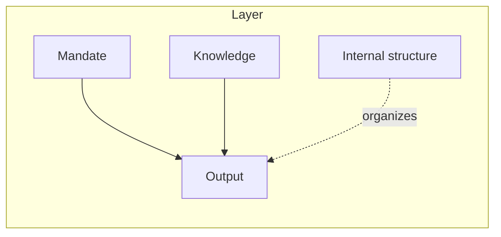
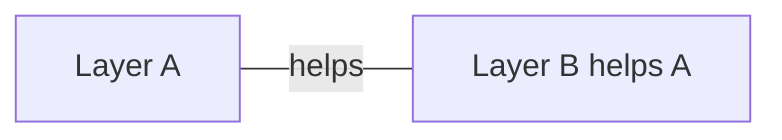
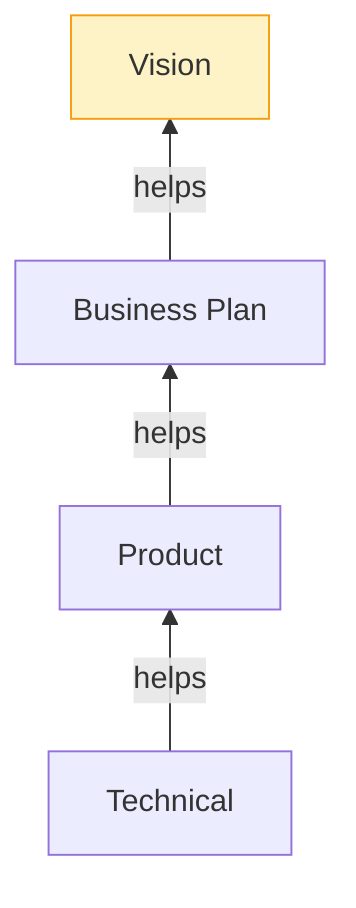
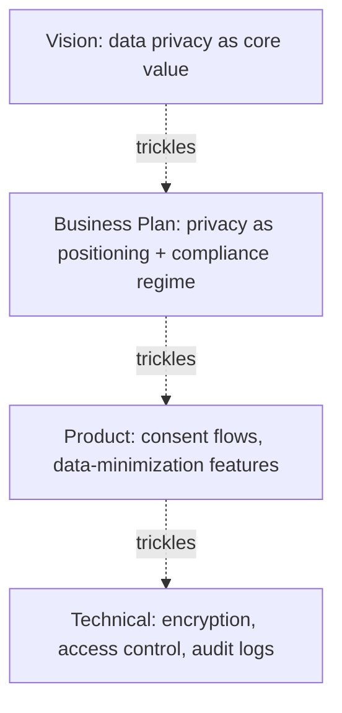
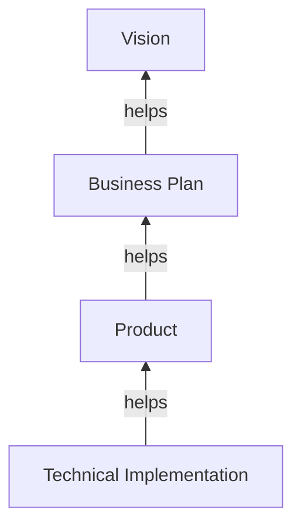
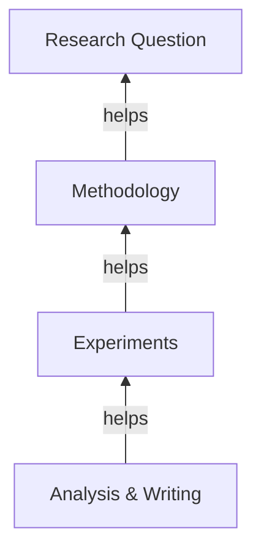
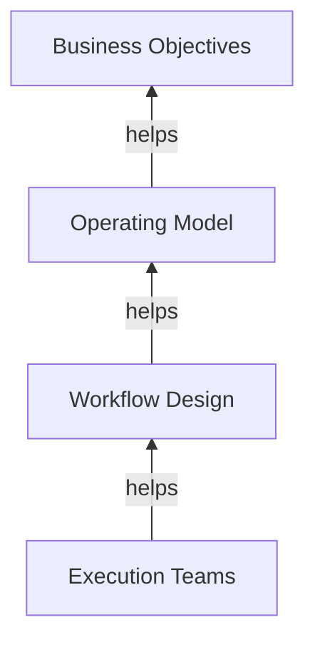

# The Layered Endeavor Framework

*A spec-driven, layered approach to organizing any endeavor — a project, a research program, a company, an operation — where the work is performed by humans, AI agents, or both.*

---

## 1. What this is

The Layered Endeavor Framework is a small set of structural principles for decomposing a complex endeavor into **layers of interfaces**, where each layer has a clean responsibility, a defined relationship to one other layer, and a transitive line of alignment back to the originating intent.

It generalizes ideas from spec-driven development, layered software architecture, hierarchical multi-agent orchestration, and strategic-alignment cascades into a single substrate that doesn't care whether the "agent" at any given layer is a human, an AI, or a team of both.

The framework is a **philosophy**, not a methodology. It commits to a small number of structural rules (the principles below) and is deliberately silent on everything else (number of layers, how help is conducted, cadence, tooling, artifact format). Adopters customize within those rules; the rules themselves are the contract.

---

## 2. Why we layer

Every complex endeavor faces the same underlying problem: **how do we keep many concurrent activities aligned with the originating intent, without forcing every activity to hold the entire context at once?**

In principle, a sufficiently capable single agent — a hypothetical AI with unlimited context and expertise — could hold all of vision, business, product, and implementation in one mind and produce a coherent endeavor. We layer for three reasons:

1. **Context limits.** Humans have working-memory limits; AI agents have context windows. Layering is a concession to those limits, not an intrinsic feature of the problem.
2. **Specialization.** Different parts of the work need different expertise, and clean boundaries let specialists operate within their mandate.
3. **Diagnosability.** When something is wrong, layered structure lets you localize the problem.

This framing has a useful corollary: **as agent capability grows, the optimal number of layers shrinks.** The framework should reduce gracefully toward a single layer when context allows, rather than imposing layers as ceremony.

A note on what matters most when applying the framework. The principles below are small and stable. Almost everything that determines whether an endeavor succeeds under the framework lives in one decision: the choice of layers. Good layer cuts make the framework feel obvious in use; bad cuts surface as the failure modes in §6. Layer design is the art that the framework constrains but does not determine, and it is where careful thought pays off most.

---

## 3. Anatomy and architecture

An endeavor under this framework is a set of **layers** connected by **help relations**. This section describes what a layer is, how layers connect, and how the structure scales. The principles in §4 then constrain these pieces into a working framework.

### 3.1 A layer

A layer is fully specified by five properties:

| Property | What it is |
|---|---|
| **Mandate** | What this layer is responsible for producing. Its single, scoped purpose. |
| **Knowledge** | The expertise, context, and information this layer operates with. Defines what kinds of help it can give. |
| **Output** | The artifact(s) the layer produces — its contribution to the endeavor. |
| **Help target** | The single other layer this layer is responsible for helping (see §4.2). The root layer has none. |
| **Internal structure** | Optional: how the layer organizes its content and exposes scoped views (see §5). |

A layer is well-formed when its mandate, knowledge, and output are mutually consistent — the knowledge supports the mandate, the output fulfills the mandate, and nothing in the output exceeds the mandate.

### 3.2 Connections between layers — the help relation

A connection between two layers is a **help relation**: one layer is responsible for helping the other. The helper is responsible *to* the helped layer, not the reverse — the relation is asymmetric in responsibility, with the helper named as such and the helped layer as its help target.

"Help" is intentionally broad. Whatever the helper's mandate and knowledge support — understanding what the helped layer needs, providing it, optimizing it, suggesting improvements, pushing back when reality forces revisions — falls under help. In practice, help shows up as specifications received, work product produced, feedback returned, questions asked, drafts shared, signals about readiness. How help actually happens in a given project is a project choice; the framework only requires that the responsibility be clear.

Visualization is a convention, not a claim. Drawing one layer above another, or arrows pointing in any particular direction, does not encode hierarchy, seniority, or importance.

The help relation is the *responsibility-bearing* connection between layers. Layers can also share information without responsibility — for example, a layer can expose a read-only view of itself to another for visibility — but those are not help relations and are covered separately (§5.6).

### 3.3 Recursive decomposition

Each layer can itself be decomposed into sublayers under the same principles. The framework is fractal: the rules that govern the top-level layering also govern any internal decomposition. This is how a layer scales up in complexity without violating its mandate.

---

## 4. The principles

The structure described above becomes a working framework when constrained by two principles. Both are prescriptive; everything else is customizable.

### 4.1 Intralayer — single responsibility, no overlap

Each layer owns its mandate fully and exclusively. No reaching across layers. No redundant ownership of the same concern between two layers. If two layers seem to claim the same responsibility, the layering is wrong and needs to be re-cut.

This is the layered-architecture analogue of the MECE principle (mutually exclusive, collectively exhaustive) and the Single Responsibility Principle.

### 4.2 The one-help rule

**Every layer except the root is responsible for helping exactly one other layer.** The root (typically the vision or originating-intent layer) has no help target; instead, every other layer is connected to the root through the help relation, possibly transitively.

This produces a tree rooted at the originating intent:

The one-help rule does two distinct jobs:

- **Alignment property.** If every non-root layer is aligned with the layer it helps, then by transitivity every layer is aligned with the root. Alignment falls out of the structure for free, with no separate audit mechanism required.
- **Design discipline.** The constraint forces clean layering. The question "if this layer can only meaningfully help one other, *which one*?" is exactly the question that produces good layer cuts. Without the constraint, layers tend to accumulate diffuse partial relationships and no layer has a sharp mandate.

Two clarifications follow from the structure:

**No cycles.** Help is asymmetric in responsibility: "A helps B" and "B helps A" are different relations, and the framework prohibits the combination. If A and B helped each other, both would have used their one-help quota on each other and neither would connect to the root, breaking transitive alignment. The same logic forbids longer cycles (A helps B helps C helps A). The tree structure follows directly: one outgoing help edge per non-root layer, every layer reaching the root, no cycles.

**Root is not the most abstract.** The tree is rooted at the originating intent for *alignment grounding*, not because the root is "above" the rest in importance or because root-ward layers must be more abstract. The root is wherever alignment grounds in the endeavor — often abstract (a vision, a research question), sometimes concrete (a fixed constraint, a specific artifact to reverse-engineer). The abstraction gradient seen in the worked examples (§12) is a common pattern, not a structural requirement.

---

## 5. Internal structure of a layer

A layer is more than a single undifferentiated blob. Layers typically need internal structure of three flavors — groupings, projections, and milestones — and the choice of how much of that structure to share with a connected layer is itself a fourth design lever, *context scope*.

### 5.1 Groupings as outcome structure

A grouping inside a layer can correspond to a real split in what the layer produces — two product lines, two codebases, two market segments, two research tracks. In this case the grouping is consequential: it commits the layer to multiple distinct outputs, not just multiple ways of organizing one output.

### 5.2 Projections as scoped views

A layer can expose multiple scoped views of itself for different consumers. A product layer might project to:

- the technical layer, organized by implementation cluster;
- the business layer, organized by revenue model;
- a UX sublayer, organized by user journey.

Same underlying layer-state, different lenses. Projections do three pieces of real work:

1. **Context management.** Projections decide what fits into any given conversation or context window — the practical lever for the framework's claim that layers exist to fit context budgets.
2. **Multi-consumer interfaces.** A layer can serve multiple readers without polluting any single interface with everything-everyone-might-want.
3. **Internal refactoring without breaking consumers.** A layer can rearrange its internals as long as projections stay stable — the same property well-designed APIs have.

### 5.3 Milestones as temporal structure

A layer's output is rarely produced in one shot. It evolves through milestones — versions, releases, phases, drafts, increments — and the framework treats this temporal structure as first-class.

Each layer can carry multiple milestones, and **which milestones are shared with a connected layer is a sharing choice**, not a default. A layer might share early drafts with its helper to enable early feedback, share only stable releases to avoid churn, or share different milestones with different connected layers.

This partially closes the question of how layers handle change over time: when a layer's output changes, the change is expressed as a new milestone, and connected layers ingest it according to the sharing policy in place.

### 5.4 Context scope as a design variable

The amount of context a layer shares with a connected layer determines how comprehensive that layer's contribution can be — and it sits on a curve, not a maximize-it dial.

- **Too little context** and the connected layer's solution is shallow because it can't see what would make it comprehensive. Constraints get re-discovered the hard way.
- **Too much context** and you blow context budgets, leak information that should stay scoped (privacy, IP, organizational sensitivity), or invite the connected layer to over-reach beyond its mandate.

Right-sizing context is its own design decision, and it changes over time and per relationship. Projections (§5.2) and selective milestone sharing (§5.3) are the *mechanisms* that make context scope adjustable; this principle is *why* the adjustment matters.

A useful default: share the smallest context that lets the connected layer give a comprehensive contribution within its mandate, and expand only when shallowness shows up as feedback.

### 5.5 Heuristic — don't structure prematurely

The "don't group prematurely" instinct generalizes to all three flavors of internal structure:

- A grouping is justified when it reduces context load for a real consumer, enables a real access or privacy boundary, or corresponds to a real outcome split.
- A projection is justified when a connected layer actually needs a different lens, not when it might one day.
- A milestone is justified when there is a real reason to mark and possibly share an intermediate state — not because intermediate states "should" be tracked.

Structure created reactively in response to a real need tends to survive. Structure created proactively because organization "feels right" tends to constrain without paying for itself. Premature structure freezes the layer before usage patterns reveal themselves and forces connected layers to work around the structure rather than through it.

### 5.6 Internal structure vs. the one-help rule

All four mechanisms — groupings, projections, milestones, context scope — operate **within a layer** and are orthogonal to the one-help rule, which governs **between layers**.

A useful distinction to keep them clean:

- **Help relations** are responsibility-bearing. They carry mutual obligations, drive influence and modification, and form the tree.
- **Informational projections, shared milestones, and context-scope adjustments** are sharing choices. They don't carry responsibility, and a layer exposing structure to another doesn't make that other layer a help target.

So a technical layer *helps* product (its one parent in the tree), but might *expose* a feasibility-summary projection to vision or business for visibility, or share milestone signals with neighbors for planning. None of those constitute help relations, and none of them violate the tree.

---

## 6. When layering goes wrong

The framework's principles, applied well, produce layered structure that feels light to operate. When layering is done badly, three failure modes show up. Each is a diagnostic signal — observe it, and re-examine the layer cuts or the discipline being applied within them. These are not taxes you pay for layering; they are symptoms that something specific needs fixing.

### 6.1 Heavy coordination overhead

**Symptom.** The boundary work — maintaining specs, running help-relation interactions, processing milestones — feels disproportionate to the actual work being done.

**Cause.** Usually too many layers, or layers without truly distinct mandates. The one-help rule keeps coordination linear in the number of layers (each layer has one outbound obligation), but linear is not zero. Every additional layer adds a boundary, and a boundary with no real specialization on the other side adds friction without function.

**Fix.** Merge layers that don't have distinct expertise, knowledge, or context. If a hypothetical layer would just be a pass-through with no real contribution of its own, it shouldn't exist.

### 6.2 Context loss

**Symptom.** Helpers repeatedly ask about things that should have been in the spec they received. Decisions get re-litigated because a connected layer didn't know about earlier reasoning. Work has to be redone when a missing constraint surfaces late.

**Cause.** Either layer outputs are incomplete relative to their mandate (the layer didn't fully express what its helper would need), or context scope is too narrow (the helper isn't being shown enough to do good work).

**Fix.** Hold layer outputs to a real completeness bar — complete relative to what the helper needs to do its job, given its mandate and knowledge. Adjust context scope when shallowness shows up as feedback. Some residual context loss is unavoidable (tacit reasoning doesn't fully fit in artifacts), but the worst kind — helpers guessing at what was wanted — is preventable.

### 6.3 Latency between layers

**Symptom.** A single conceptual decision bounces between two layers many times before settling. Wall-clock time is dominated by round-trips across a particular boundary.

**Cause.** The two layers are too tightly coupled to be cleanly separated — their decisions genuinely co-evolve, and forcing them through a help-relation interface adds ceremony to what wants to be one conversation.

**Fix.** Merge them. Latency across a boundary is usually a sign that the boundary shouldn't exist.

### Summary

| Failure mode | Diagnostic signal | Usual fix |
|---|---|---|
| Coordination overhead | Boundary work feels heavy vs. real work | Merge layers without distinct mandates |
| Context loss | Helpers ask about things that should have been specified | Tighten output completeness or expand context scope |
| Latency | Decisions ping-pong across a boundary | Merge tightly-coupled layers |

Layering done well — clean cuts, complete outputs, right-sized context — produces structure that holds without producing these. When they appear, they're telling you something about the layer design that you should listen to.

---

## 7. Cross-cutting concerns

Concerns that seem to apply everywhere — security, privacy, ethics, observability, brand, accessibility, compliance — are notorious for resisting tree-shaped placement. The conventional response is a single org-wide policy document. This usually fails: the document is stated at a level of abstraction that matches no layer's working reality, each layer translates it implicitly anyway, and the appearance of central handling masks the actual local re-interpretation.

The framework's approach: **a cross-cutting concern enters the tree at some layer and propagates as a first-class requirement, customized by each layer for its own vocabulary.**

This works because the framework already provides traceability for free (§8). The customized version at each layer references its parent in the trickle, so all four layers' privacy work descends from a single root statement and drift can be detected by walking the tree.

The clean implication: **cross-cutting concerns don't need a special mechanism.** They are just additional inputs into a layer's mandate, propagated via the same one-help relation that handles everything else. This simplifies the framework rather than expanding it.

---

## 8. Traceability is free

A direct consequence of the tree structure: every output, requirement, decision, or concern has a traceable lineage through first-degree help relations back to the root. The tree *is* the trace.

Most frameworks bolt traceability on as audit infrastructure. Here it is a structural property — anything you want to trace is already traceable by construction. If something seems hard to trace, it's because the layering itself is broken.

---

## 9. Robustness properties

The framework's properties are a direct consequence of its principles:

| Property | Source |
|---|---|
| **Transitive alignment** | One-help rule + connection to root → tree → transitivity. |
| **Free traceability** | Tree structure means every artifact has a path to the root. |
| **Hydratable** | A layer can start with a minimal output and be enriched over time; the principles drive the enrichment. |
| **Customizable** | The principles are fixed; how help happens, layer count, artifact format, and cadence are open. |
| **Graceful reduction** | When one agent has full capability and context, the framework collapses to one layer without violating its rules. |
| **Diagnosable** | Misalignment surfaces at the boundary between two adjacent layers, not in a global pile. |
| **Exploration-safe** | A layer can experiment freely within its mandate; misalignment surfaces at the help boundary and either propagates as improvement or reverts. |
| **Async-friendly** | The principles together — single help relation per layer, intralayer responsibility, milestones as explicit checkpoints, projections as stable interfaces, context scope as a sharing choice — mean layers can operate concurrently without continuous synchronization. The framework doesn't require async (synchronous teams use it fine), but it makes async genuinely safe, which most coordination frameworks don't. |

---

## 10. What the framework does not commit to

Deliberately left open:

- **How many layers.** Domain- and capability-dependent.
- **Which layers.** The art of layering.
- **How help actually happens.** What the help relation looks like in practice — sequence of interactions, who initiates, what gets exchanged when — is project-customizable.
- **Artifact format.** Markdown specs, code, diagrams, conversations, OKRs — all valid.
- **Cadence and process.** Continuous, milestone-driven, async, sync — all valid.
- **Whether agents are humans, AI, or hybrid.** Symmetric by design.

This is the balance between structure and freedom: the principles constrain enough to provide guarantees, and nothing more.

---

## 11. Operating the framework

The framework specifies what must be true, not how to produce it. Structure and operation are different concerns, and the framework commits only to structure. Approval flows, cadences, ceremonies, and definitions of done are deliberately left to the project — they depend too much on size, stakes, and culture to be specified universally.

That said, a small set of operational questions must be answered for the framework to work in practice: what counts as "ready enough" for a layer's output to be consumed; how a helper pushes back along the help relation; how connected layers learn that a new milestone exists; and where conflicts go when feedback cannot be reconciled with the spec. Other choices — decision rights, cadence, approval gates, artifact format, audit policy — are common but optional.

Operational overhead should be proportional to stakes. As scale and stakes grow, these conventions become more formal: implicit understandings become explicit checklists, then documented procedures. The structure underneath is identical; the ceremony around it is what changes.

---

## 12. Worked examples

### 12.1 Software product

| Layer | Mandate | Knowledge | Output |
|---|---|---|---|
| Vision | Why this endeavor exists | Founder intent, world context | Vision statement, principles |
| Business Plan | How this endeavor sustains itself | Markets, competition, economics | Strategy, model, GTM, finance |
| Product | What we build for users | User needs, design, market fit | Specs, user stories, roadmap |
| Technical | How we build it | Engineering, architecture, ops | Architecture, code, infrastructure |

Example feedback along a help relation: the technical layer discovers that a real-time feature in the product spec would require a 10x infrastructure investment. It surfaces this back to the product layer, which can revise the user story (eventual consistency may be acceptable), which may in turn surface to the business layer if the change affects positioning.

*Relationship to spec-driven development.* This example maps naturally onto SDD practice. Each layer's output is a spec for the layer it helps — the product layer's specs and user stories are exactly what an SDD workflow produces between product and engineering, and the framework generalizes the same idea up the tree (vision specs that ground business plans, business specs that ground product). SDD's spec→plan→tasks→implement flow can be read as a particular layering of the technical layer; the framework gives the broader structure. Adopters using SDD already get most of the framework's lower-half mechanics; the framework adds the higher-level layers and the alignment guarantee across them.

### 12.2 Research program

| Layer | Mandate | Output |
|---|---|---|
| Research Question | What we want to know and why it matters | Question, hypotheses, success criteria |
| Methodology | How we'll find out | Experimental design, data plan |
| Experiments | Running the methodology | Data, observations, replications |
| Analysis & Writing | Interpreting and communicating | Results, conclusions, paper |

Feedback example: experiments yield unexpected results suggesting the methodology has a confound. The feedback surfaces to methodology, which may revise the design and may need to surface further if the original question turns out to be less tractable than the revised one.

### 12.3 Operations / business unit

| Layer | Mandate | Output |
|---|---|---|
| Business Objectives | What outcomes the unit must deliver | OKRs, success metrics |
| Operating Model | How the unit organizes to deliver | Org structure, decision rights, cadences |
| Workflow Design | The processes that produce outcomes | SOPs, playbooks, tooling |
| Execution Teams | Running the workflows | Daily output, exceptions handled |

---

## 13. Open questions

Things the framework deliberately leaves for adopters and for future iteration:

- **Positive layering heuristics.** §6 covers diagnostic signals when layering has gone wrong. Open: positive guidance for choosing good cuts up front. Likely useful directions: split when feedback latency between sublayers is high; merge when two layers always change together; introduce a new layer when an existing mandate is stretching beyond its knowledge.
- **DAG variants.** When a strict tree is impractical, what's the smallest principled relaxation that preserves transitive alignment? (E.g., diamond dependencies with explicit reconciliation rules.)
- **Versioning across layers.** Milestones (§5.3) provide the temporal substrate, but the protocol for how a connected layer ingests a new milestone — when to upgrade, how to detect breaking changes, whether to maintain compatibility with prior milestones — is left to adopters. Likely analogous to API versioning.
- **Conflict resolution patterns.** §11 requires projects to define their own conflict-resolution path, but the framework does not yet offer guidance on what good paths look like — when to escalate up the tree vs. resolve at the boundary, how to handle persistent disagreements, what role the root plays as a final arbiter.

---

## 14. Glossary

- **Endeavor** — Any complex undertaking the framework is applied to: a project, company, research program, operation.
- **Layer** — A unit of the endeavor with a single mandate, defined knowledge, an output, and at most one help target.
- **Mandate** — The scoped responsibility a layer owns exclusively.
- **Help relation** — The asymmetric responsibility-bearing connection between a layer and its help target. "Help" covers whatever the helper's mandate and knowledge support: understanding what the helped layer needs, providing it, optimizing, suggesting improvements, pushing back when reality forces revisions. How help actually happens is a project choice. The collection of help relations forms the tree.
- **Help target** — The one other layer a non-root layer is responsible for helping.
- **Grouping** — Internal organization of a layer's content, possibly corresponding to splits in its outputs.
- **Projection** — A scoped, often read-only view of a layer exposed to another consumer for visibility, distinct from a help relation.
- **Milestone** — A marked point in a layer's temporal evolution (version, release, phase, draft). Sharing a milestone with a connected layer is a sharing choice, not automatic.
- **Context scope** — The amount of a layer's content shared with a connected layer; a design variable to be right-sized between shallowness (too little) and budget/privacy/over-reach (too much).
- **Cross-cutting concern** — A concern (security, privacy, ethics, etc.) that enters the tree at some layer and propagates as a customized requirement through the help relations.
- **Transitive alignment** — The property that, given the one-help rule and connection to root, alignment with one's parent implies alignment with the originating intent.

---

*This document captures the framework as worked out collaboratively. The principles are intended to be stable; the examples and heuristics are intended to evolve.*
